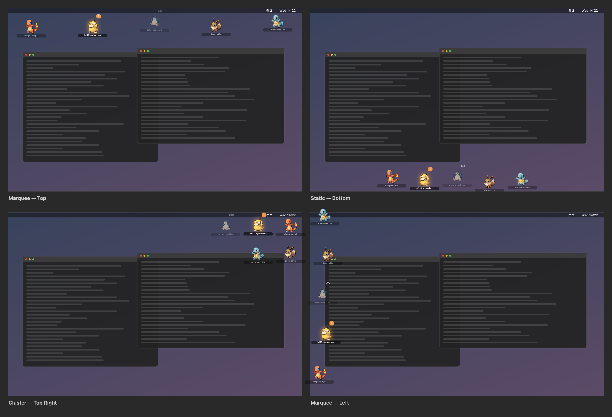
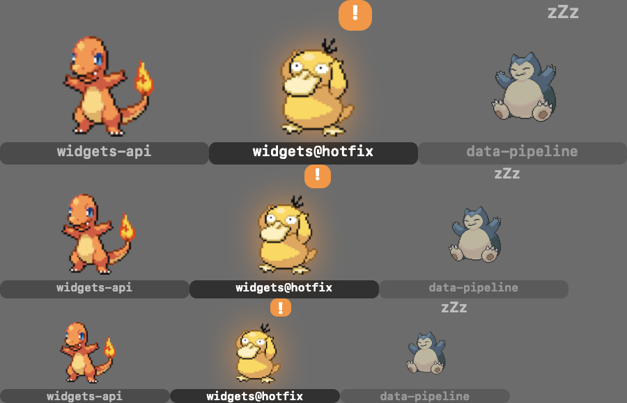

# poke-agents

Your running Claude Code sessions, as Pokémon on your desktop.

Every session gets a sprite. It wanders your screen while the agent works, stops
and waves an exclamation mark when the agent needs you, and curls up asleep when
the turn is done. Click one to jump straight to the terminal running it.





*Sprite states, left to right: `running`, `attention`, `done`. Sizes, top to
bottom: large, medium, small.*

> Both images are generated, not captured. The wallpaper and window shapes are
> drawn by the app in an offscreen render, the session names are invented, and no
> real screen appears anywhere — but the sprite positions come from the actual
> layout engine, so the arrangements are exactly what you get. Regenerate them
> with `POKEAGENTS_RENDER_MODES=out.png PokeAgents.app/Contents/MacOS/PokeAgents`.

The point is peripheral vision. If you run several agents at once, the thing you
actually need to know is *which one is waiting on you* — and you need to know it
without alt-tabbing through terminals to check. A sprite that stops moving and
starts flashing in the corner of your eye answers that question for free.

---

## Contents

- [Requirements](#requirements)
- [Install](#install)
- [How it works](#how-it-works)
- [Display modes](#display-modes)
- [Sizes](#sizes)
- [Sprite states](#sprite-states)
- [Species, and shiny rates](#species-and-shiny-rates)
- [Clicking a sprite](#clicking-a-sprite)
- [Adding your terminal](#adding-your-terminal)
- [Command reference](#command-reference)
- [Configuration](#configuration)
- [Troubleshooting](#troubleshooting)
- [Uninstall](#uninstall)
- [What this installs, and what it can do](#what-this-installs-and-what-it-can-do)
- [Sprites and licensing](#sprites-and-licensing)

---

## Requirements

- macOS 13 or later
- Xcode Command Line Tools (`xcode-select --install`) — full Xcode is **not** needed
- Python 3.8+ (macOS ships this)
- Claude Code

## Install

```bash
git clone https://github.com/urnotsam/poke-agents.git
cd poke-agents

./overlay/build.sh            # builds PokeAgents.app (~30s, no Xcode required)
./cli/poke-agents fetch --all   # caches 180 species (~720 files, one time)
./cli/poke-agents install       # wires the hooks and installs terminal adapters
open overlay/PokeAgents.app
```

`install` backs up `~/.claude/settings.json` before touching it, and only ever
adds entries it marks as its own — see [what this installs](#what-this-installs-and-what-it-can-do).

Sessions already running won't have sprites until they next do something. To see
them immediately:

```bash
./cli/poke-agents adopt --watch
```

The two sources cooperate: once a session writes its own record via the hook,
`adopt` steps aside for it, so you never get two sprites for one session. Hooks
label a session by its repository; `adopt` can use the terminal's title, which is
often more specific.

Check everything landed:

```bash
./cli/poke-agents doctor
```

## How it works

```
Claude Code session
      │  hook events (SessionStart, PreToolUse, Notification, Stop, …)
      ▼
pokeagents_hook.py                  Python, standard library only
      │  one atomic JSON write
      ▼
~/.claude/poke-agents/sessions/*.json      one file per live session
      │  FSEvents
      ▼
PokeAgents.app                      Swift menu-bar agent
      │  one borderless window per sprite
      ▼
your desktop
```

The filesystem is the message bus. No server, no database, no socket, no network
listener. Each half works with the other absent: the hook writes files whether or
not the overlay is running, and the overlay happily animates hand-written JSON.

Two consequences worth knowing:

- **Dead sessions get cleaned up automatically.** `SessionEnd` doesn't fire on a
  crash or `kill -9`, so the overlay also checks every 10 seconds whether each
  recorded pid still exists and despawns the ones that don't. Without that, the
  display slowly fills with ghosts and stops meaning anything.
- **The hook is built to stay out of your way.** It always exits 0 and never
  writes to stdout — `SessionStart` stdout gets injected into the model's context,
  so a stray `print` would quietly pollute your conversation. Diagnostics go to
  `~/.claude/poke-agents/hook.log`.

## Display modes

Twelve arrangements, from the menu bar icon under **Display**:

| Group | Modes | Behaviour |
|---|---|---|
| **Marquee** | Top, Bottom, Left, Right | Sprites travel along the edge and wrap around |
| **Static** | Top, Bottom, Left, Right | Evenly spaced along the edge, holding position |
| **Cluster** | Top Left, Top Right, Bottom Left, Bottom Right | A three-column grid tucked in the corner |

Four of the twelve are pictured at the top of this page.

All twelve come from one geometry model rather than twelve special cases. The
rule that makes it work: **sprites wander only across their line of travel, never
along it.** Wandering along the line would let neighbours close the gap and
overlap; wandering across it never can. In the marquee modes every sprite also
travels at exactly the same speed, so the even spacing assigned once is spacing
kept forever.

Twelve modes × three sizes × five screen sizes are covered by ~302,000 assertions
checking that sprites never overlap, never leave the screen, never jump when
their state changes, and — in the cluster modes — that the labels don't collide
either. That last one exists because generating the screenshots above is what
revealed the labels overlapping while the sprites technically didn't.

## Sizes

Small (44pt), Medium (58pt), Large (72pt), from the menu bar under **Size**.

Gen 5 sprites are around 96px natively, so even Large is a slight downscale and
everything stays crisp — sampling is nearest-neighbour, because smoothing pixel
art is the fastest way to make it look cheap.

## Sprite states

| State | What it means | What you see |
|---|---|---|
| `running` | The agent is working | Idle animation loops, sprite drifts along |
| `attention` | **The agent is waiting on you** | Fast bob, orange `!` bubble, pulsing glow, label at full brightness |
| `done` | The turn finished | Static sprite, dimmed to 60%, `zZz` drifting up |

`attention` comes from Claude Code's `Notification` hook, which covers both
permission prompts and idle input requests. It's the state the whole thing exists
to surface, so it also wins any contest for screen space: if more sprites are
live than fit, an `attention` sprite will evict a `done` one rather than be
hidden itself.

## Species, and shiny rates

Species is derived from the session id:

```
species = SPECIES[fnv1a(session_id) % 180]
```

Session ids are random, so this feels like a wild encounter — but because it's
derived rather than stored, the same session keeps its species across an overlay
restart with nothing persisted. If two live sessions would draw the same species,
the second probes forward to the next free one, so you never see doubles.

The roster is 180 species, curated for silhouette legibility at 72pt — the test
of inclusion is whether you can tell what it is from across a desk.

### Shiny

**A sprite has a 1 in 64 chance of being shiny** (about 1.6%), decided by a second
hash of the session id. Like the species, it's derived rather than rolled, so a
shiny session stays shiny for its whole life and across restarts.

That is *far* more generous than the games: 1 in 8192 in Gen 2–5, 1 in 4096 from
Gen 6 on. Those odds are tuned for a game you play for hundreds of hours. At 1 in
4096 you would start roughly ten sessions a day and see your first shiny in about
a year, which is not a feature, it's a rumour. At 1 in 64 you'll see one every
week or two — rare enough to be a small event when it happens, common enough to
actually exist.

To change it, edit `SHINY_ODDS` in [`hook/pokeagents/species.py`](hook/pokeagents/species.py).
Set it to `1` if you want everything shiny, which is a legitimate aesthetic
choice and looks quite good in the cluster modes.

## Clicking a sprite

**Left click** focuses the terminal running that session — the sprite is a
launcher, not just a status light. See the `!` in the corner of your eye, click
it, you're in the session that needs you.

If no adapter can focus the session — a background agent (`claude --bg`) has no
terminal at all — the sprite shakes instead.

**Right click** opens a menu for that specific session:

| Item | What it does |
|---|---|
| *(header)* | The session's label, state, last tool used, and directory |
| Focus Session | Same as a left click |
| Copy Working Directory | Puts the session's `cwd` on the clipboard |
| Reveal in Finder | Opens that directory |
| Hide This Sprite | Mutes it until its state changes |
| Display / Size | The same submenus as the menu bar |

Hiding is a mute, not a dismissal. A hidden sprite reappears the moment its
session does something new, so a session you hid can never go on to need you
silently. The menu bar shows a **Show N hidden** item while any are muted.

## Labels

The label carries a session's identity, since the species is random. Two sources:

- **From hooks** — the git repository name, plus the branch for a worktree
  (`acme@hotfix`).
- **From `adopt`** — the terminal's title, which is usually what you asked the
  agent to do.

Titles are phrased as instructions, so they get compressed rather than simply
cut off. "Implement Granola document demo feature requests" truncated at 20
characters gives you "Implement Granola do…" — all of which every other title
also starts with. Dropping the leading verb and the filler words instead gives
**"Granola document"**, which is the part that tells them apart.

Labels are capped at 20 characters, wide enough for a `repo@branch` worktree
label. Change `MAX_LEN` in
[`hook/pokeagents/labels.py`](hook/pokeagents/labels.py) if you want more or
less.

## Adding your terminal

PokeAgents ships adapters for **herdr**, **Terminal.app**, **iTerm2**, **tmux**,
**WezTerm**, and **Ghostty**. Adding your own means writing one small executable —
you never touch Swift or rebuild the app.

An adapter is any executable in `~/.claude/poke-agents/terminals/`, in any language,
that answers two subcommands via its exit code:

```bash
myterm detect              # exit 0 if this terminal is usable right now
myterm focus <pid> <tty>   # exit 0 if you actually focused the session
```

There's an optional third, `discover`, which lets `poke-agents adopt` list sessions
your terminal already knows about before they've fired any hook.

Full contract, worked examples, and testing instructions:
**[terminals/README.md](terminals/README.md)**.

Adapters for new terminals are very welcome as PRs.

## Command reference

| Command | What it does |
|---|---|
| `poke-agents install` | Add the hooks to `~/.claude/settings.json` (backs it up first) |
| `poke-agents uninstall` | Remove exactly the entries it added |
| `poke-agents doctor` | Report hooks, state, sprite cache, overlay, and display mode |
| `poke-agents ls` | List live sessions as a table |
| `poke-agents adopt [--watch]` | Show sessions your terminal already knows about |
| `poke-agents fetch --all` | Download and cache the sprite roster |
| `poke-agents terminals` | List adapters and which ones detect |
| `poke-agents simulate [--count N]` | Write fake sessions, for working on the overlay itself |

## Configuration

`~/.claude/poke-agents/config.json`:

```json
{
  "mode": "marqueeTop",
  "size": "large",
  "terminals": ["herdr", "iterm2", "terminal-app"]
}
```

`mode` and `size` are normally set from the menu bar. `terminals` is optional and
sets adapter priority; unlisted adapters are tried afterwards in alphabetical
order.

Environment variables:

| Variable | Effect |
|---|---|
| `POKEAGENTS_DISABLE=1` | Hook does nothing — turn it off without uninstalling |
| `POKEAGENTS_HOME` | Move the state directory (default `~/.claude/poke-agents`) |

## Troubleshooting

**No sprites appear.** Run `poke-agents doctor`. Hooks only fire on a session's
*next* event, so try typing something, or run `poke-agents adopt --watch`.

**Clicking does nothing.** Run `poke-agents terminals` to see whether any adapter
detects. If yours isn't listed, [write an adapter](terminals/README.md) — it's
about ten lines. Check `~/.claude/poke-agents/overlay.log`, which records every
click, the pid and tty it resolved, and whether focusing succeeded.

**Clicking switches the tab but doesn't bring the window forward.** Your adapter's
`focus` is doing half the job. It needs to select the tab *and* activate the host
application; this is the most common mistake when writing one.

**Sprites are Poké Balls.** The sprite cache is empty or the download failed. Run
`poke-agents fetch --all`.

**A sprite is stuck.** The overlay reaps sessions whose process is gone within 10
seconds. If one persists, its pid is genuinely still alive — check with
`poke-agents ls`, which flags stale records.

**Sprites cover something important.** Switch to a cluster mode, or Small, or hit
Pause in the menu bar.

## Uninstall

```bash
./cli/poke-agents uninstall     # removes only its own hook entries
rm -rf ~/.claude/poke-agents    # state, sprite cache, config, logs
```

Then quit the app from the menu bar and delete `PokeAgents.app`.

## What this installs, and what it can do

Worth being explicit, because this asks you to run code on every Claude Code
event.

`poke-agents install` adds six entries to `~/.claude/settings.json`, one per hook
event, each running `hook/pokeagents_hook.py` from wherever you cloned this repo.
Claude Code hooks are arbitrary shell commands, so **anything in that script runs
with your user's full privileges, on every event, in every session.** That is
true of any Claude Code hook, and it's worth understanding before installing one
from the internet — including this one.

What this hook actually does: reads the event JSON on stdin, resolves the owning
process, and writes one small JSON file. It makes no network requests. The only
component that touches the network is `poke-agents fetch`, which downloads sprites
over HTTPS from `play.pokemonshowdown.com` when you run it explicitly.

Everything stays on your machine. Nothing is sent anywhere. Session labels can
include your working-directory and terminal-title text, so they're written only
to `~/.claude/poke-agents/` and drawn on your own screen.

The installer backs up your settings file first, marks its own entries so
`uninstall` removes exactly those and nothing else, and refuses to touch a
settings file it can't parse. One side effect worth knowing: because it rewrites
the file atomically through a temp file, `settings.json` ends up owner-only
(0600) even if it was more permissive before.

Three more things a security review of this project surfaced, which you should
know rather than have to discover:

- **The session directory is user-writable and unauthenticated.** Anything
  running as you can drop a file into `~/.claude/poke-agents/sessions/` and make a
  sprite appear. Values read back from those files are therefore treated as
  untrusted: adapters receive the pid and tty as arguments and never as shell or
  AppleScript text, and a species that isn't a plain Showdown id is refused
  rather than used to build a file path. If you write an adapter, keep that
  property — never interpolate a session field into a command string.
- **Sprites come from a third-party CDN.** `poke-agents fetch` downloads from
  `play.pokemonshowdown.com`. Responses are pinned to that host across redirects,
  size-capped, and checked for GIF/PNG magic bytes before being cached, but they
  are not signature-verified.
- **The overlay asks for Automation permission** so it can control your terminal
  via AppleScript. That grant is what makes click-to-focus work; denying it
  leaves everything else functional.

There are no third-party dependencies — the Python side is standard library
only, and the Swift package has no external packages — so there is no dependency
supply chain to audit beyond this repository itself.

## Sprites and licensing

**The code** is MIT licensed. See [LICENSE](LICENSE).

**The sprites are not mine, and are not in this repository.** PokeAgents ships a
downloader, not artwork. `poke-agents fetch` pulls sprites at runtime from
[Pokémon Showdown](https://play.pokemonshowdown.com/sprites/) into a local cache
on your own machine. The only bundled image is a Poké Ball, drawn in code as a
fallback.

Pokémon and Pokémon character names are trademarks of Nintendo, Creatures Inc.,
GAME FREAK Inc., and The Pokémon Company. This is an unofficial fan project,
unaffiliated with and unendorsed by any of them, intended for personal use. The
Gen 5 animated sprites for later-generation Pokémon were made by the Smogon
community; if you plan to do anything with these assets beyond running this on
your own desktop, talk to [Smogon](https://github.com/smogon/sprites) first.

## Contributing

Bug reports, terminal adapters, and species-roster arguments all welcome. See
[CONTRIBUTING.md](CONTRIBUTING.md).

Run the tests:

```bash
cd hook && PYTHONPATH=. python3 -m unittest discover -s tests
cd overlay && swift run PokeAgentsTests
```
